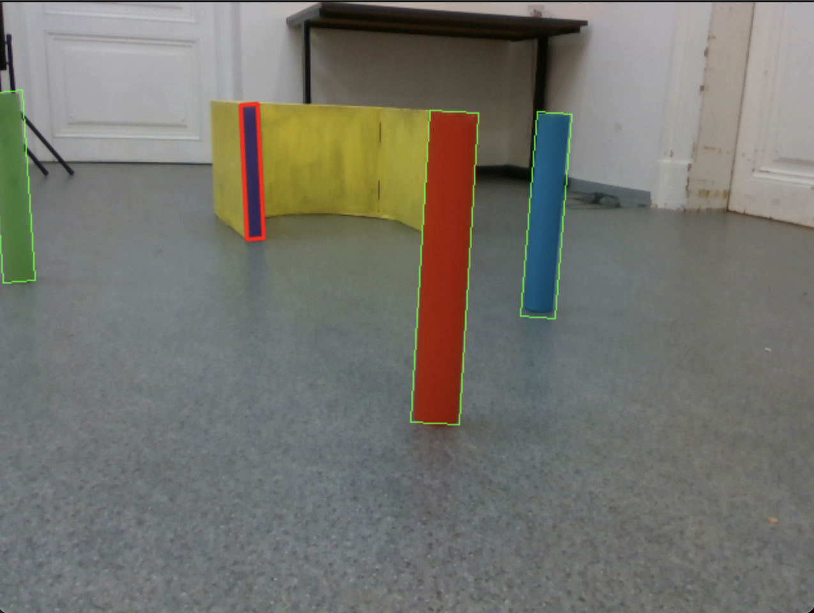
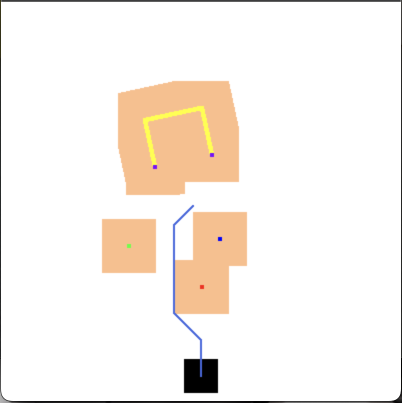

# LAR
___
Project for semester work of LAR (eng Laboratories And Robots)

This program is capable to bild the way to garage from image, similar to what you can see in the folder "map_images".
To get the way and see map run main.py, (to change image change img_path in main.py)
Press m to see the map.
Also, you may have to change colors in image_analysis.py, for other lights.
___
+ __Robot:__ TurtleBot
+ __Requirements:__
  + cv2
  + numpy
  + matplotlib
  + robolab_turtlebot
___
__Example of object detection__

  

__Example of way building__

  

### Result:

  

